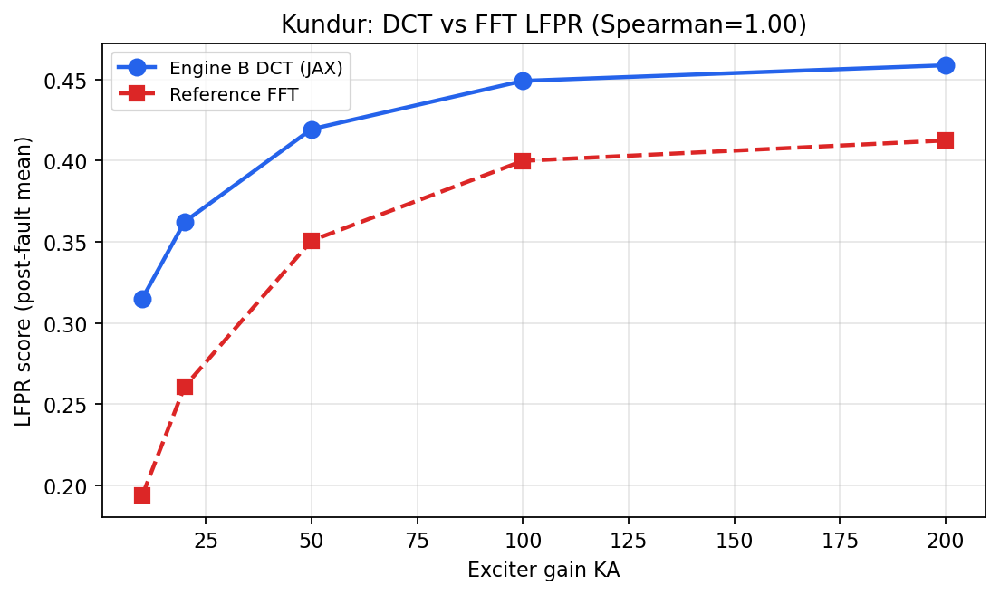
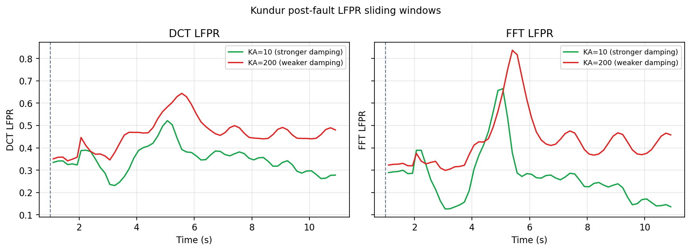
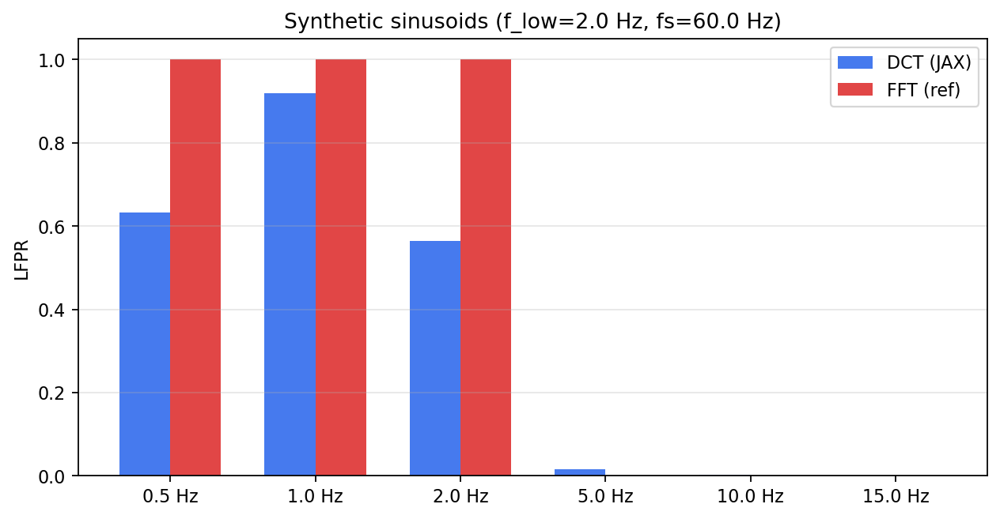
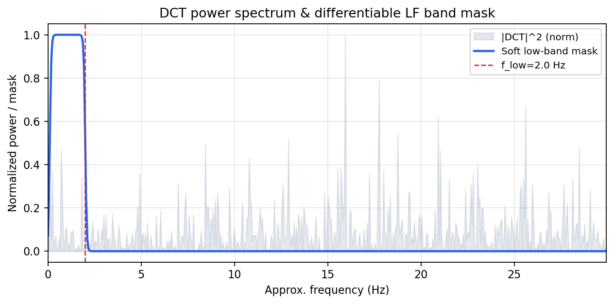

# LF CSD-NN

**Differentiable LFPR and spectral-entropy metrics** — reference implementation of CSD **Engine B** (JAX).

Symmetric to [Jacobi-CSD-NN](https://github.com/jackman993/Jacobi-CSD-NN) (Engine A: Jacobian damping ratio), this package implements frequency-domain **Low-Frequency Power Ratio (LFPR)** and **spectral entropy** via orthonormal DCT-II, validated against the FFT reference in `CSD_dual_engine` on ANDES Kundur trajectories.

> TaiScience Research Group | Research / education only.

**Languages:** [繁體中文](README.md) · **English**

---

## Overview

| Module | Description |
|--------|-------------|
| `SpectralEngineB` | Sliding-window LFPR + entropy (aligned with `engine_b`) |
| `abc_to_dq` | Differentiable Park transform |
| `build_engine_b_pipeline` | `vmap` + `jit` multi-bus batching |
| `compute_lfpr_and_entropy` | Single-window DCT core |

### Engine A vs B

| | Jacobi-CSD-NN | **LF CSD-NN** |
|--|---------------|---------------|
| Engine | A (time-domain Jacobian) | **B (frequency LFPR)** |
| Stack | PyTorch | **JAX** |
| Metric | Damping ratio ζ | **LFPR + spectral entropy** |

### Validation figures

Generated by `lf_csd_nn.figure_engine.FigureEngine`:

| Fig | Content |
|-----|---------|
| Fig 1 | KA sweep DCT vs FFT LFPR |
| Fig 2 | Post-fault LFPR time series |
| Fig 3 | Synthetic single-frequency comparison |
| Fig 4 | DCT spectrum + soft mask |









```bash
python examples/generate_figures.py
```

---

## Install

```bash
pip install -e .
pip install -e ".[dev]"
```

Enable FP64:

```python
import jax
jax.config.update("jax_enable_x64", True)
```

---

## Quick start

```python
from lf_csd_nn import EngineBConfig, SpectralEngineB

engine = SpectralEngineB(EngineBConfig(window_size=120, fs=60.0, f_low=2.0))
# score_lfpr, score_ent = engine.score_trajectory(t, y, channel_idx)
```

```bash
python examples/smoke_test.py
python tests/test_engine_b_andes.py
```

---

## Tests

| Test | Description |
|------|-------------|
| TEST 1 | DCT-II orthogonality |
| TEST 2 | Finite LFPR gradients |
| TEST 3 | Synthetic DCT vs FFT LFPR |
| TEST 4 | ANDES KA sweep: Spearman(DCT, FFT) > 0.85 |
| TEST 5 | 1000-bus batch smoke |

---

## Related

- [Jacobi-CSD-NN](https://github.com/jackman993/Jacobi-CSD-NN)
- [CSD-Grid-Dual-Engine](https://github.com/chihsingwu/CSD-Grid-Dual-Engine)
- [ANDES](https://github.com/CURENT/andes)

---

## License

MIT
